<div align="center">
  
</div>

<div align="center">

  [](https://ashish-ai-portfolio.web.app)
  [](https://www.linkedin.com/in/ashish-rai-0a4983207/)
  [](https://github.com/rai-ms)
  [](https://www.hackerrank.com/ashishraimse?hr_r=1)
  [](mailto:ashishraimse@gmail.com)

</div>

<br/>

<div align="center">
  <h3>⚡ Software Engineer specializing in <strong>Generative AI Architectures, Autonomous Multi-Agent Systems & Scalable Production Engineering</strong>.</h3>
  <p>Currently engineering enterprise systems at <strong><a href="https://appinventiv.com">Appinventiv</a></strong> (Noida Sector 135) with <strong>3+ years of production delivery</strong>.</p>
</div>

---

### 🤖 Core AI Engineering & Generative Systems *(Top Focus)*

```
  ┌─────────────────┐      ┌─────────────────────────┐      ┌─────────────────────────┐      ┌─────────────────────────┐
  │ Multimodal Data │ ───► │  Hybrid Neural Search   │ ───► │ Cohere Cross-Encoder    │ ───► │ LangGraph Agent Graph   │
  │ (PDF/Text/OCR)  │      │ Qdrant + pgvector + BM25│      │  (+32% Relevancy Boost) │      │ (Deterministic Cycles)  │
  └─────────────────┘      └─────────────────────────┘      └─────────────────────────┘      └────────────┬────────────┘
                                                                                                          │
                                 ◄ 300ms SLA Low-Latency SSE Token Stream ◄───────────────────────────────┘
```

- 🤖 **Autonomous Multi-Agent DAGs:** Architecting stateful cyclic execution graphs with **LangGraph**, **CrewAI**, and **Model Context Protocol (MCP)** featuring structured tool execution, automated reflection, and human-in-the-loop review gates.
- 🧠 **Enterprise Hybrid Neural RAG:** Sub-300ms retrieval combining dense embeddings (**Qdrant, pgvector, FAISS**) with BM25 sparse keyword search, contextual chunking, and **Cohere Cross-Encoder reranking** for citation-grounded outputs.
- 👁️ **Vision-Language Document Intelligence & OCR:** End-to-end extraction microservices using **LayoutLMv3**, **GPT-4o Vision**, and **PaddleOCR** delivering **96.4% precision** across clinical records, diagnostic charts, and KYC documents.
- ⚡ **LLM Fine-Tuning & High-Throughput Serving:** Fine-tuning open models (Llama 3, Gemma, Mistral) via **LoRA/QLoRA** for strict JSON schemas; deploying self-hosted **vLLM** endpoints with PagedAttention and Redis semantic caching (**38% cost reduction**).
- 🛡️ **LLMOps, Evals & Guardrails:** Automated production evaluation pipelines with **LangSmith**, **Arize Phoenix**, NeMo Guardrails, and PII anonymization.

---

### 🛠️ Comprehensive Tech Stack

<table>
  <thead>
    <tr bgcolor="#1E293B">
      <th align="center" width="28%">Domain</th>
      <th align="left">Technologies, Frameworks & Tooling</th>
    </tr>
  </thead>
  <tbody>
    <tr>
      <td align="center"><strong>🤖 AI, LLMs & Agents<br/><em>(Primary Core)</em></strong></td>
      <td>
        
        
        
        
        
        
        
        
        
        
        
      </td>
    </tr>
    <tr>
      <td align="center"><strong>🗄️ Vector DBs & Backend</strong></td>
      <td>
        
        
        
        
        
        
        
        
        
      </td>
    </tr>
    <tr>
      <td align="center"><strong>📱 Mobile Architecture</strong></td>
      <td>
        
        
        
        
        
        
        
        
        
      </td>
    </tr>
    <tr>
      <td align="center"><strong>☁️ LLMOps, Cloud & DevOps</strong></td>
      <td>
        
        
        
        
        
        
        
        
      </td>
    </tr>
  </tbody>
</table>

---

### 🚀 Production Highlights & Flagship Systems

<table>
  <tr>
    <td width="50%">
      <h4>🏥 Enterprise Clinical Document Digitizer & Vision OCR</h4>
      <ul>
        <li><strong>Architecture:</strong> Vision-Language pipeline (<em>GPT-4o Vision, LayoutLMv3, PaddleOCR</em>) parsing noisy doctor prescriptions, lab tables, and diagnostic charts.</li>
        <li><strong>Impact:</strong> Achieved <strong>96.4% field precision</strong> and reduced claim turnaround times by <strong>75%</strong> with automated KYC anti-spoofing fraud defense.</li>
        <li><strong>Stack:</strong> <code>Python</code>, <code>FastAPI</code>, <code>LayoutLM</code>, <code>PyTorch</code>, <code>PaddleOCR</code>, <code>Docker</code></li>
      </ul>
    </td>
    <td width="50%">
      <h4>🤖 Autonomous Enterprise Multi-Agent Platform</h4>
      <ul>
        <li><strong>Architecture:</strong> Stateful cyclic multi-agent DAGs built with <em>LangGraph</em> and <em>pgvector</em> dense embeddings for candidate evaluation, screening, and anomaly detection.</li>
        <li><strong>Impact:</strong> Slashed manual recruiter review efforts by <strong>90%</strong> with <strong>98% routing accuracy</strong> and automated task execution.</li>
        <li><strong>Stack:</strong> <code>LangGraph</code>, <code>LlamaIndex</code>, <code>pgvector</code>, <code>FastAPI</code>, <code>GPT-4o</code>, <code>Celery</code></li>
      </ul>
    </td>
  </tr>
  <tr>
    <td>
      <h4>👥 Bloom Multiverse Enterprise Mobile Apps</h4>
      <ul>
        <li><strong>Architecture:</strong> Companion employee & partner mobile apps built from scratch on React Native 0.83 + Expo EAS with Atomic Design systems.</li>
        <li><strong>Capabilities:</strong> Azure AD SSO, MMKV offline persistence, Dynatrace APM, and full i18n localization.</li>
        <li><strong>Stack:</strong> <code>React Native</code>, <code>Expo</code>, <code>TypeScript</code>, <code>Zustand</code>, <code>React Query</code></li>
      </ul>
    </td>
    <td>
      <h4>🎬 PVR Cinemas & Virgin Connect Roam (Flutter)</h4>
      <ul>
        <li><strong>Scale:</strong> High-concurrency ticket booking and global eSIM platform deployed across <strong>200+ countries</strong>.</li>
        <li><strong>Performance:</strong> Real-time seat reservation sync, Clean Architecture BLoC, and instant profile activation.</li>
        <li><strong>Stack:</strong> <code>Flutter</code>, <code>Dart</code>, <code>BLoC</code>, <code>Clean Architecture</code>, <code>WebSockets</code></li>
      </ul>
    </td>
  </tr>
</table>

---

### 📊 GitHub Activity & Metrics

<div align="center">
  
</div>

<div align="center">
  
  
</div>

<div align="center">
  
</div>

---

<div align="center">
  🌐 <strong>Try the Live Interactive AI Copilot on my Portfolio:</strong><br/>
  👉 <strong><a href="https://ashish-ai-portfolio.web.app">ashish-ai-portfolio.web.app</a></strong><br/><br/>
  <sub>Designed & engineered with precision by <strong><a href="https://github.com/rai-ms">Ashish Rai</a></strong></sub>
</div>
